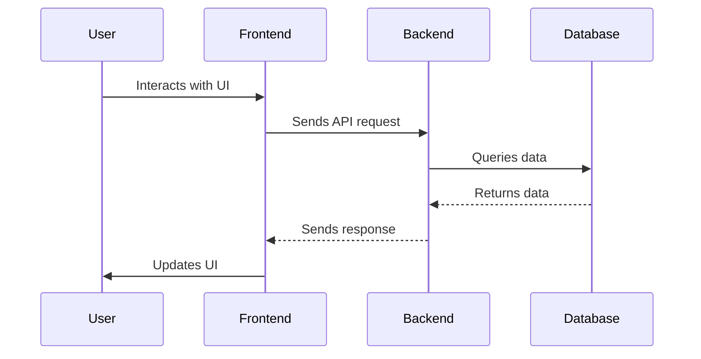

# Frontend vs Backend: A Comprehensive Guide

Welcome to this comprehensive guide on frontend vs backend development! Whether you're new to web development or looking to deepen your understanding of how different parts of a web application work together, this guide will walk you through the key concepts, technologies, and roles in frontend and backend development.

## Introduction

Web development is often divided into two main areas: frontend and backend. These two aspects of development work together to create fully functional websites and web applications. Let's dive into what each of these terms means and how they contribute to the web development process.

## Frontend Development

Frontend development, also known as client-side development, focuses on everything that users directly interact with on a web page.

### Key Aspects of Frontend Development:

1. **User Interface (UI)**: Creating the visual elements that users see and interact with.
2. **User Experience (UX)**: Ensuring the website is intuitive, accessible, and enjoyable to use.
3. **Responsiveness**: Making sure the website looks good on all devices and screen sizes.

### Frontend Technologies:

- **HTML**: Structure of the web page
- **CSS**: Styling and layout
- **JavaScript**: Interactivity and dynamic content

```html
<!DOCTYPE html>
<html lang="en">
<head>
    <meta charset="UTF-8">
    <meta name="viewport" content="width=device-width, initial-scale=1.0">
    <title>My Website</title>
    <link rel="stylesheet" href="styles.css">
</head>
<body>
    <h1>Welcome to My Website</h1>
    <p>This is a simple example of frontend code.</p>
    <script src="script.js"></script>
</body>
</html>
```

### Frontend Frameworks and Libraries:

- React
- Vue.js
- Angular
- Svelte

## Backend Development

Backend development, also known as server-side development, focuses on the behind-the-scenes functionality of web applications.

### Key Aspects of Backend Development:

1. **Server Logic**: Processing data and performing operations.
2. **Database Management**: Storing and retrieving data.
3. **API Development**: Creating endpoints for frontend-backend communication.
4. **Security**: Implementing authentication, authorization, and data protection.

### Backend Technologies:

- **Programming Languages**: Python, JavaScript (Node.js), Ruby, Java, PHP, C#
- **Databases**: MySQL, PostgreSQL, MongoDB, Redis
- **Server Software**: Apache, Nginx
- **APIs**: RESTful, GraphQL

```python
# Example of a simple backend API using Flask (Python)
from flask import Flask, jsonify

app = Flask(__name__)

@app.route('/api/data')
def get_data():
    data = {
        "message": "This is data from the backend!",
        "status": "success"
    }
    return jsonify(data)

if __name__ == '__main__':
    app.run(debug=True)
```

### Backend Frameworks:

- Express.js (Node.js)
- Django (Python)
- Ruby on Rails (Ruby)
- Spring Boot (Java)
- ASP.NET Core (C#)

## How Frontend and Backend Work Together

1. **Client-Server Model**: The frontend (client) sends requests to the backend (server), which processes the requests and sends back responses.

2. **API Communication**: The frontend communicates with the backend through APIs, typically using HTTP requests.

3. **Data Flow**: 
   - User interacts with the frontend
   - Frontend sends a request to the backend
   - Backend processes the request, interacts with the database if necessary
   - Backend sends a response back to the frontend
   - Frontend updates the UI based on the response



## Comparing Frontend and Backend Development

| Aspect | Frontend | Backend |
|--------|----------|---------|
| Focus | User interface and experience | Server-side logic and data management |
| Languages | HTML, CSS, JavaScript | Various (Python, JavaScript, Ruby, Java, etc.) |
| Output | What the user sees and interacts with | Data processing, storage, and retrieval |
| Tools | Browsers, CSS preprocessors, JS frameworks | Servers, databases, API tools |
| Performance Concerns | Load time, responsiveness | Processing speed, scalability |

## Full-Stack Development

Full-stack developers are proficient in both frontend and backend development. They understand how all parts of a web application work together and can develop end-to-end solutions.

## Conclusion

Understanding the distinction between frontend and backend development is crucial for anyone involved in web development. While they focus on different aspects of web applications, both are essential for creating robust, efficient, and user-friendly websites and applications. As the web continues to evolve, the line between frontend and backend may blur with technologies like serverless architecture and isomorphic applications, but the fundamental principles of client-side and server-side development remain crucial to web development.

Whether you choose to specialize in frontend, backend, or pursue full-stack development, having a solid understanding of both areas will make you a more versatile and effective developer. Happy coding!